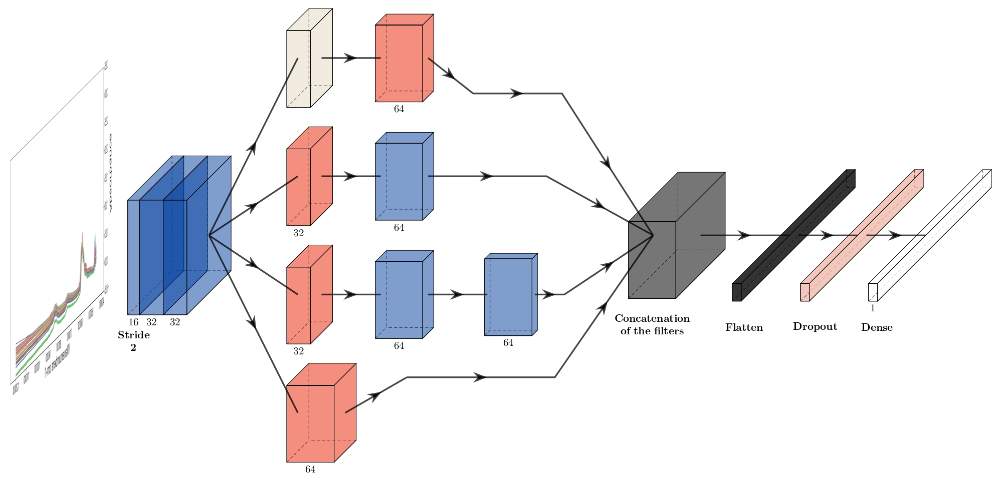
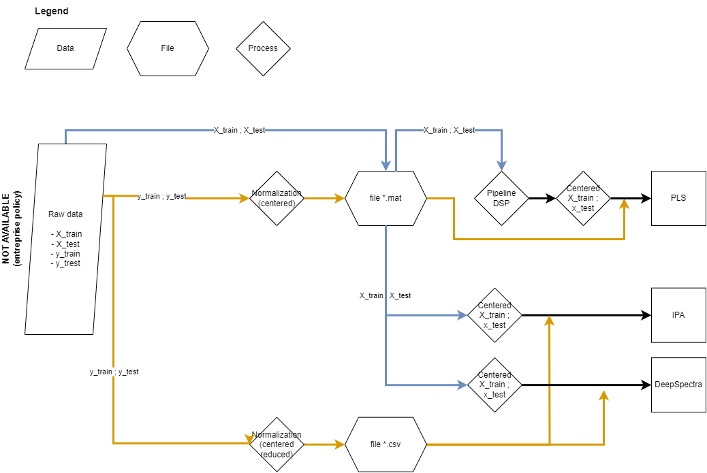

# Inception Petroleum Analysis
This repository shows the code used in the publication "Inception for Petroleum Analysis" for cetane number prediction. 

## The IPA Deep CNN architecture



Convolutions with kernel size 3 are shown in blue, convolutions with kernel size 1 are shown in red. 
The numbers of neurons are shown under each computational blocks. 
For more details, verify on the paper under the section -> Methodology / Deep learning. 

## Getting started

### Python
Follow the next commands:
```
conda create -n inception-petroleum-analysis python=3.10

conda activate inception-petroleum-analysis 

conda install -c conda-forge cudatoolkit=11.2 cudnn=8.1.0

pip install -r requirements.txt
```
### Matlab
Install [MATLAB R2022b](https://www.mathworks.com/products/new_products/release2022b.html) and [Eigenvector PLS_Toolbox version 9.2](https://wiki.eigenvector.com/index.php?title=Release_Notes_Version_9_2).

## Launching environment
### Matlab

Open the script within the eponymous software.

### Python

Activate the environment, then

#### IPA calibration
```
python -m scripts.IPA-calibration
```

#### DeepSpectra calibration
```
python -m scripts.DeepSpectra-calibration
```

### Notes about our data



Information : all y are already normalized to follow entreprise policy, the scaler is not given. Therefore, calculated metrics will be roughly 10 times smaller than on the publication. 
- PLS will be fed using X and y from 'data/raw-kennard-full_range.mat', y is already normalized (centered) but X are raw.
- IPA and DeepSpectra will be fed using y from 'y_train_scaled.csv' and 'y_test_scaled.csv' (mean 0 & std 1), the X comes raw from 'data/raw-kennard-full_range.mat' or feature selected from 'data/raw-kennard-reduced_range.mat'

